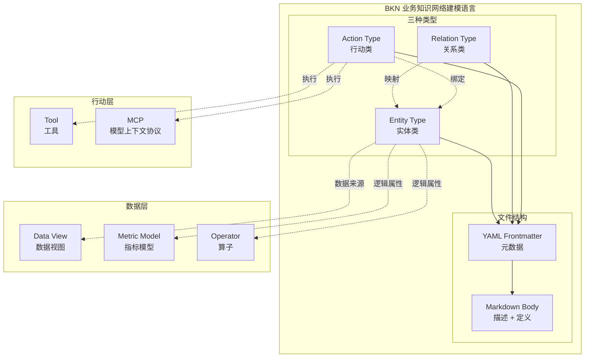
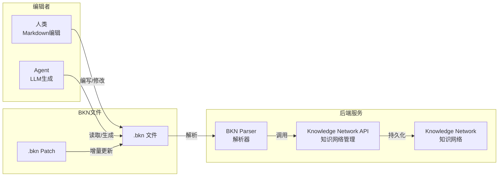
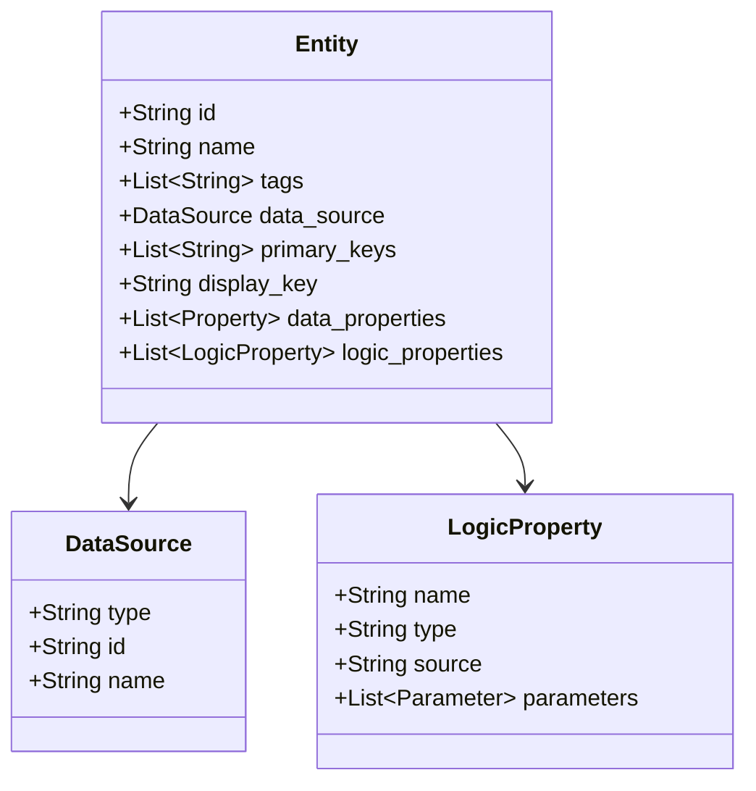
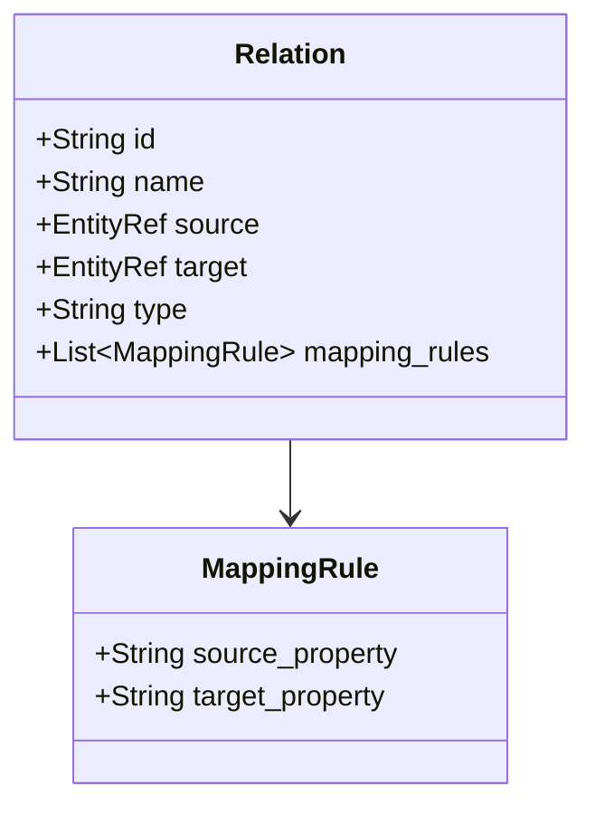
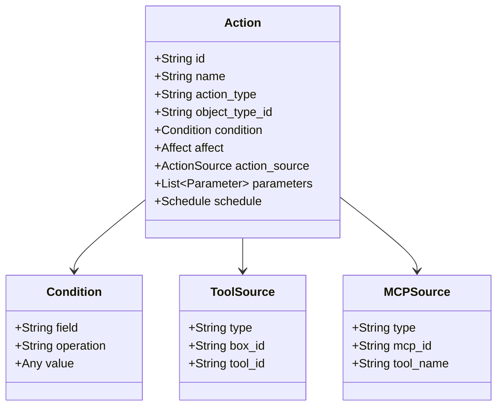
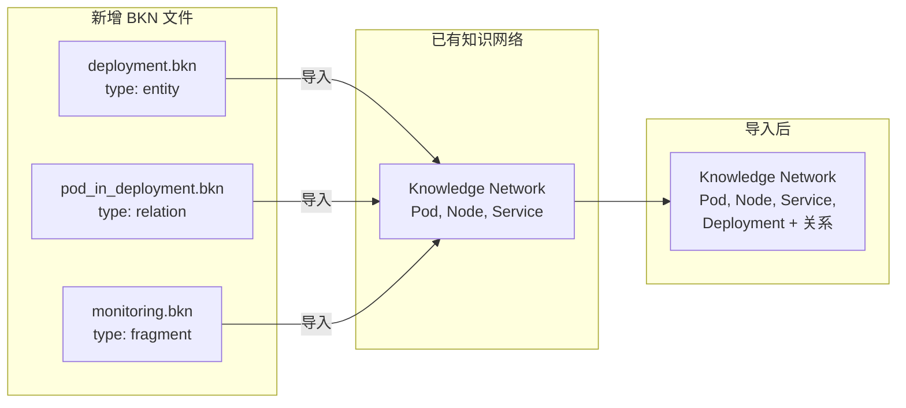

# BKN 架构设计

BKN (Business Knowledge Network) 是一种 Markdown-based 的业务知识网络建模语言，用于描述业务知识网络中的实体、关系和行动。

## 设计理念

- **人类可读**: 使用 Markdown 语法，业务人员也能理解和编辑
- **Agent 友好**: 结构化的 YAML frontmatter + 语义化的 section，便于 LLM 解析和生成
- **增量导入**: 任何 `.bkn` 文件可直接导入到已有的知识网络，支持动态更新
- **大规模友好**: 每个定义可以是独立文件，100 个实体 = 100 个小文件
- **灵活组织**: 支持单文件、按类型拆分、每定义一文件等多种模式

## 架构概览



## 工作流



## 三种类型

### 实体类 (Entity Type)

描述业务对象，如 Pod、Node、Service 等。

**核心特性**:
- 直接映射数据视图，自动继承字段
- 可选的属性覆盖配置
- 支持逻辑属性（指标、算子等）



### 关系类 (Relation Type)

描述两个实体之间的关联关系。

**核心特性**:
- 定义起点和终点实体
- 支持直接映射和视图映射
- 声明属性映射规则



### 行动类 (Action Type)

描述可执行的操作，绑定工具或 MCP。

**核心特性**:
- 绑定目标实体
- 定义触发条件
- 配置执行工具和参数
- 支持调度配置



## 文件组织

BKN 支持多种组织模式，根据知识网络规模选择：

### 模式一：单文件（小型网络）

所有定义在一个 `.bkn` 文件中，适合 < 20 个定义：

```
k8s-topology.bkn          # type: network
```

### 模式二：按类型拆分（中型网络）

按实体/关系/行动分文件，适合 20-100 个定义：

```
k8s-network/
├── index.bkn             # type: network
├── entities.bkn          # type: entities
├── relations.bkn         # type: relations
└── actions.bkn           # type: actions
```

### 模式三：每定义一文件（大型网络，推荐）

每个实体/关系/行动单独一个文件，适合 100+ 个定义：

```
k8s-network/
├── index.bkn                    # type: network (可选索引)
├── entities/
│   ├── pod.bkn                  # type: entity
│   ├── node.bkn                 # type: entity
│   └── service.bkn              # type: entity
├── relations/
│   ├── pod_belongs_node.bkn     # type: relation
│   └── service_routes_pod.bkn   # type: relation
└── actions/
    ├── restart_pod.bkn          # type: action
    └── cordon_node.bkn          # type: action
```

**优势**：
- 每个文件 50-100 行，人类易读
- LLM 处理时无 token 限制问题
- 便于团队协作和版本控制
- 支持按需加载

## 增量导入机制

BKN 的核心特性是支持**动态增量导入**：任何 `.bkn` 文件可直接导入到已有的知识网络。



### 导入行为

| 场景 | 行为 |
|------|------|
| ID 不存在 | 新增定义 |
| ID 已存在 | 更新定义（覆盖） |
| 删除定义 | 使用 `type: delete` 标记 |

### 支持的文件类型

| type | 说明 | 用途 |
|------|------|------|
| `network` | 完整知识网络 | 初始化或全量导入 |
| `entity` | 单个实体定义 | 增量添加/更新实体 |
| `relation` | 单个关系定义 | 增量添加/更新关系 |
| `action` | 单个行动定义 | 增量添加/更新行动 |
| `fragment` | 混合片段 | 包含多个类型的部分定义 |
| `delete` | 删除标记 | 删除指定的定义 |

### 典型工作流

1. **初始化**: 导入 `network` 类型的完整定义
2. **扩展**: 导入单个 `entity`/`relation`/`action` 文件
3. **批量扩展**: 导入 `fragment` 类型的混合片段
4. **修改**: 导入同 ID 的文件，自动覆盖
5. **删除**: 导入 `type: delete` 标记的文件

## 与 知识网络管理 API 的映射

> 说明：接口路径仅用于表达 BKN 概念与系统 API 的对应关系，具体实现路径以实际部署为准。

| BKN 概念 | API 端点 |
|----------|----------|
| Entity | `/api/knowledge-networks/{kn_id}/object-types` |
| Relation | `/api/knowledge-networks/{kn_id}/relation-types` |
| Action | `/api/knowledge-networks/{kn_id}/action-types` |

## 参考

- [BKN 语言规范](./SPECIFICATION.md)
- [BKN vs RESTful API 对比](./BKN_vs_REST_API.md)
- 样例：
  - [单文件模式](./examples/k8s-topology.bkn) - 所有定义在一个文件
  - [按类型拆分](./examples/k8s-network/) - 实体/关系/行动分文件
  - [每定义一文件](./examples/k8s-modular/) - 每个定义独立文件（推荐大规模场景）
